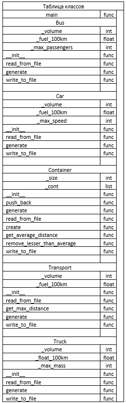
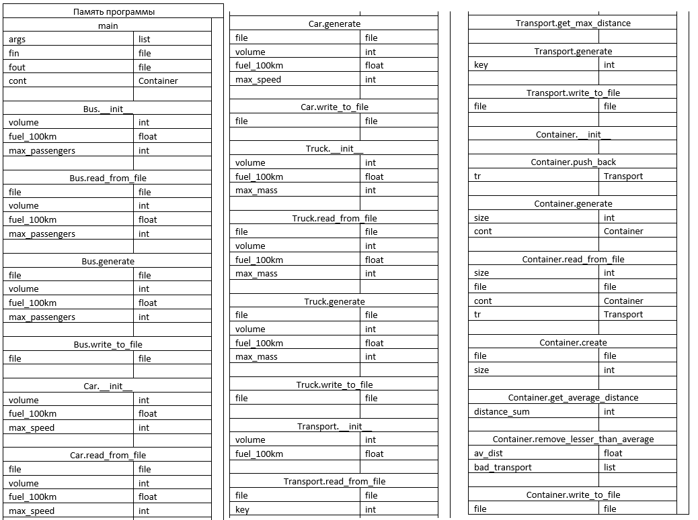
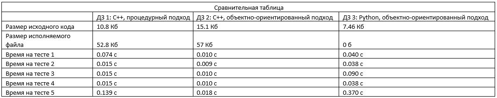

Домашнее задание №3 по Архитектуре Вычислительных Систем

# Заявка на бонус
- 0: раздельная компиляция и применение систем сборки в этом ДЗ невозможно в связи с отсутствием этапа компиляции.
- 1: разбиение на модули; есть тесты: с нулём элементов, с максимальным числом элементов, с полностью некорректными данными.
- 2: методы всех классов имеют документацию (поясняющие комментарии).

# Описание задания
Вариант №294: задача №14, функция №21. Для запуска из командной строки нужно передать в качестве аргументов названия входного и выходного файлов. Во входном файле сначала передаётся количество элементов в контейнере, а затем, если оно не превышает 20, элементы в формате "номер_типа_транспорта объём_бака расход_топлива специальные_данные_для_конкретного_типа_транспорта".

# Схема программы на базе ВС

# Метрики программы
- Общий размер файлов исходного кода: 7.46 Кб
- Размер исполняемого файла: 0 б (исполняемых файлов в том же смысле, как, например, в предыдущих дз, в этой работе не формируется)
- Интерфейсных модулей: 0 (в Python интерфейс от реализации не отделяют)
- Модулей реализации: 6
- Время работы на тестах:
  - 1: 0.040с
  - 2: 0.038с
  - 3: 0.090с
  - 4: 0.038с
  - 5: 0.370с

# Сравнение с другими реализациями

Python, как интерпретируемый язык с динамической типизацией, гораздо медленнее компилируемых языков со статической типизацией. Зато из-за этого и особенностей самого языка размер файлов с исходным кодом заметно меньше (почти вдвое меньше, чем в ДЗ 2, например)
